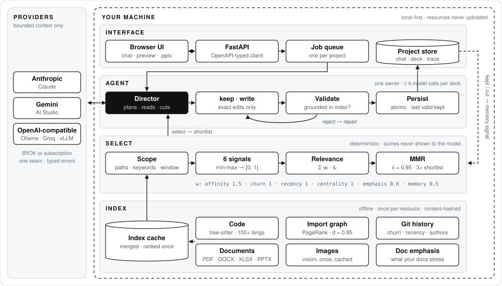
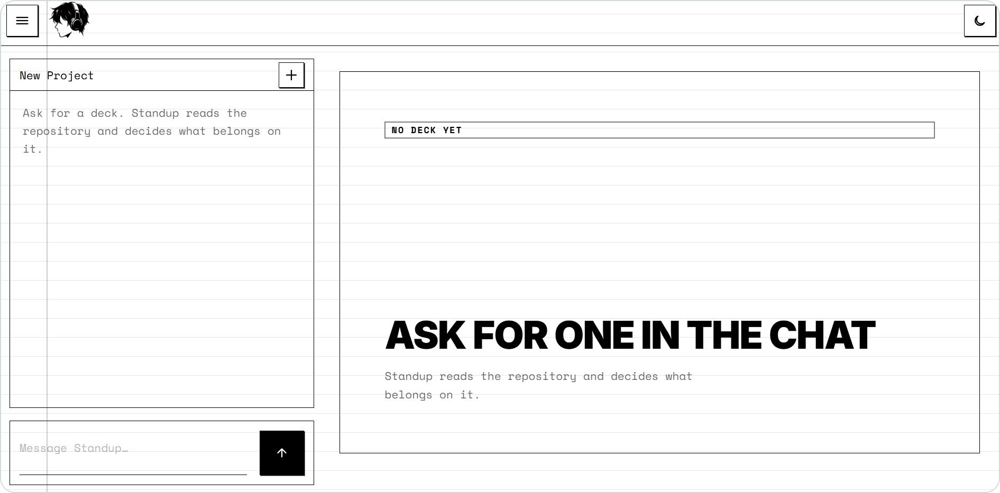

<p align="center">
  
</p>

<h1 align="center">Standup</h1>

<p align="center">
  
  
  
  
</p>

## Quick start

```sh
# macOS / Linux
curl -fsSL https://raw.githubusercontent.com/v1-nce/standup/main/install.sh | sh

# Windows (PowerShell)
irm https://raw.githubusercontent.com/v1-nce/standup/main/install.ps1 | iex

standup   # opens http://127.0.0.1:8000
```

First run asks for one model key and saves it to `~/.standup/.env` (`MODEL_API_KEY=`).

1. **New project** → attach a folder path or drop documents.
2. **Ask:** *"standup tomorrow, three slides on what changed this week."*
3. **Correct:** *"drop the second one,"* *"reword slide three."*
4. **Download** the `.pptx`.

## Problem

Standups, demos, reviews, handovers: most of us present every week, and the slides are the easy part. **The hard part is deciding what to say.** Your work is spread across code, documents and past decks, your memory of the last few days is blurry, and you rebuild the whole picture from scratch before every update. Existing tools make the slides look good, but none of them help you decide what belongs on them.

- **You forget what you did.** After a busy few days, memory blurs. You recall what you *think* happened, not what did.
- **Your work is scattered.** It's split across code, documents, past presentations and chat threads. Nothing pulls it together.
- **You start from zero every time.** The effort you put into last week's update doesn't carry into this week's.
- **AI tools don't know what matters.** Hand an AI everything and it says everything is important. You get a summary, not a point.
- **Understanding work is already most of the job.** Developers spend roughly 58% of their time just understanding code ([Xia et al., 2018](https://doi.org/10.1109/TSE.2017.2734091)). Presenting makes you pay that cost again.

| Tool | Examples | The catch |
|---|---|---|
| AI slide makers | Gamma, SlideSpeak, Presenton | Beautiful slides, but only from text *you* write. They can't see your work. |
| AI notebooks | NotebookLM, Claude Projects | Answer what you ask. Useless when you don't know what to ask. |
| Standup bots | Geekbot, Standuply | Collect what you type. No slides, no judgment. |
| Code explainers | DeepWiki, GitDiagram | Explain everything, equally. No sense of what's worth presenting. |
| Copy-paste into ChatGPT | ChatGPT, Claude | Only sees what you paste, forgets it next time, and gives you text instead of a deck. |

**Standup fills the gap.** Point it at your work once. It remembers everything, figures out what matters, and turns it into a presentation you can edit just by talking to it.

## How Standup works

<p align="center">
  
</p>

**Index.** Every resource is parsed once and cached by content hash: tree-sitter symbols for 100+ languages, an import graph ranked with PageRank (d = 0.85), full git history (diffs, authorship, timestamps), and extracted text from PDF / DOCX / XLSX / PPTX. Resources merge under prefixed IDs, then rank **once** across the whole set.

**Select.** Each candidate gets six signals, each min-max normalised to [0, 1] across the candidate set:

| Signal | Source | Weight |
|---|---|---:|
| affinity | request terms in paths and content: `5·log1p(path hits) + log1p(content hits)` | 1.5 |
| churn | `log1p(lines changed)`, since churn is power-law | 1.0 |
| recency | latest authored commit | 1.0 |
| centrality | PageRank over imports | 1.0 |
| emphasis | what the project's own docs stress | 0.6 |
| memory | kept (+1) / cut (−1) in earlier decks | 0.5 |

$$\mathrm{rel}(c) = \sum_i w_i \, \hat{s}_i(c)$$

The shortlist is drawn with Maximal Marginal Relevance, so eight slides don't land on one subsystem:

$$c^{\star} = \arg\max_{c \in R \setminus S} \left[ \lambda \, \widehat{\mathrm{rel}}(c) - (1-\lambda) \max_{s \in S} \mathrm{overlap}(c, s) \right]$$

**Decide.** An AI director reads each shortlisted candidate's source and makes the editorial cut (`keep`). It never sees the scores, so its cut is judgment on evidence, not re-ranking. Every claim it writes is checked against the index before it's kept; ungrounded output is rejected and repaired within a fixed budget (≤ 4 model calls per new deck).

**Self-improving.** Each deck records what was kept and cut. That trace feeds back as the `memory` signal: a visible, weighted nudge that never overrides the current request. Local, inspectable, reversible.

**Correct.** Chat is the editing surface. `keep` reorders exactly as told; `write` touches only the slides named. A correction is a command, not a negotiation.

## Features

<p align="center">
  
</p>

- **Git is the record.** What you actually did beats what you remember.
- **Local-first.** Code, index, decks and history stay on your machine. Only bounded model context leaves.
- **Model agnostic.** Anthropic, Gemini, or any OpenAI-compatible endpoint (OpenAI, OpenRouter, Groq, Ollama, LM Studio, vLLM). One key, auto-detected.
- **Grounded.** Every slide cites evidence that exists in the index.
- **Editable.** Selection is visible before render; output is native, editable `.pptx`.
- **Lightweight.** No vector DB, no embeddings, no headless browser, no Docker.

## Performance

| | |
|---|---|
| **Time to a deck** | 30–90 seconds |
| **Cost per deck** | Under $0.01 |
| **Memory** | Under 40 MB, freed when a project closes |

Measured on Gemini Flash-Lite. Cost and speed depend on the model you connect.

## License

[MIT](LICENSE)
