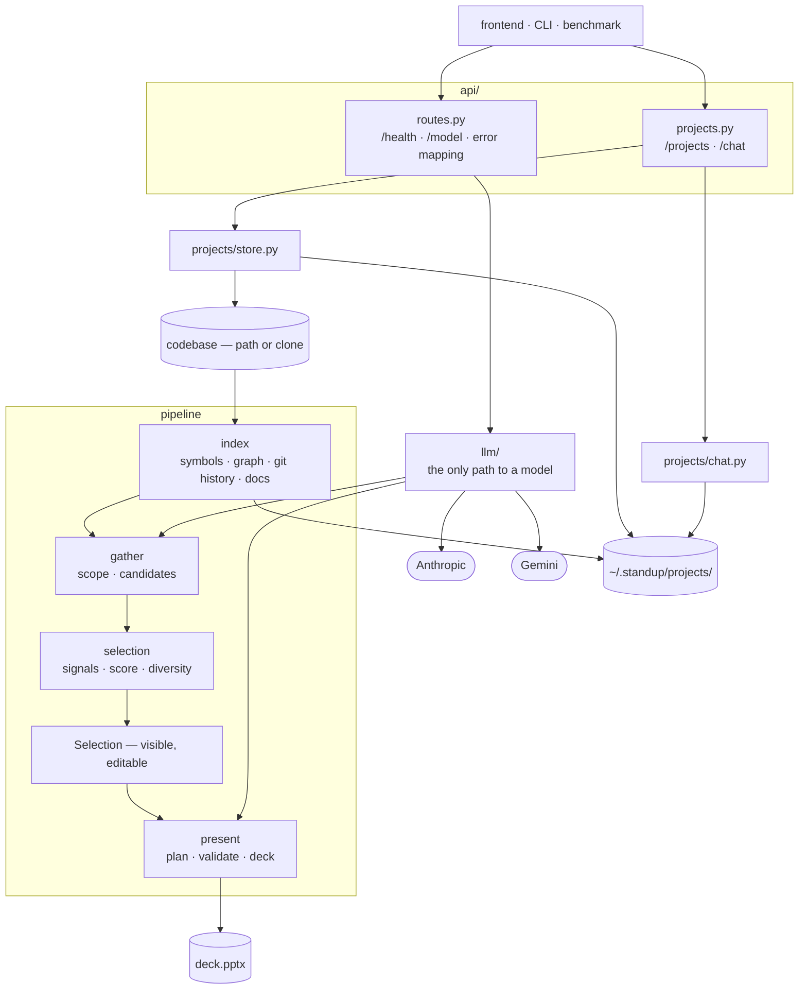

# Standup — backend

## Section 1: Introduction

The analysis core and the HTTP service that wraps it. Registered resources in, slide deck out.

A user registers a project — a codebase path or a git URL — and Standup keeps it indexed locally. They then ask for a deck in chat, and Standup decides what belongs on the slides.

## Section 2: Folder Hierarchy and Contents

```
backend/
├── requirements.txt     dependencies
├── pytest.ini           test config
├── src/
│   ├── main.py          app wiring — routers and the error handler
│   ├── config.py        settings from .env
│   ├── errors.py        the one exception hierarchy
│   ├── api/
│   │   ├── routes.py    /health, /model, /model/check, error → HTTP mapping
│   │   ├── projects.py  /projects and /projects/{id}/chat
│   │   └── decks.py     propose, read, edit and build a deck
│   ├── gather.py        what the request puts in play — scope, then candidates
│   ├── index/
│   │   ├── __init__.py  build and cache the index; rebuilds only on change
│   │   ├── code.py      walk and parse — symbols and import tokens
│   │   ├── graph.py     PageRank over the import graph
│   │   ├── history.py   git log — commits, authorship, churn
│   │   └── docs.py      what the project's own writing dwells on
│   ├── llm/             the only path to a model; nothing outside knows which provider
│   │   ├── __init__.py  the ModelClient contract and the provider registry
│   │   ├── client.py    Anthropic
│   │   └── gemini_client.py  Gemini via AI Studio — temporary free stand-in
│   ├── pipeline.py      the four stages, stitched; propose then build
│   ├── models/
│   │   ├── api.py       API request/response shapes
│   │   ├── artifacts.py the pipeline's spine — index through slide plan
│   │   └── project.py   project, source, chat message
│   ├── present/
│   │   ├── plan.py      one call — the Selection becomes slide text
│   │   ├── validate.py  the trust boundary; a plan that drifts or invents is refused
│   │   └── deck.py      SlidePlan → .pptx
│   ├── projects/
│   │   ├── store.py     projects on disk — create, list, get, delete
│   │   └── chat.py      append-only conversation log
│   └── selection/       named for the artifact; `select` is a stdlib module
│       ├── __init__.py  assembles the Selection — what was chosen, what was cut, and why
│       ├── signals.py   the five free signals, as a registry
│       ├── score.py     the one weights table
│       └── diversity.py MMR — relevance traded against repetition
└── tests/               one file per module
```

## Section 3: Architecture



## Section 4: Quick Start

Requires Python 3.12+ and `git`.

```powershell
cd backend
python -m venv .venv
.\.venv\Scripts\Activate.ps1     # macOS/Linux: source .venv/bin/activate
pip install -r requirements.txt
```

Add one key to `.env` at the repo root (copy `.env.example`):

```
ANTHROPIC_API_KEY=sk-ant-...     # or
GEMINI_API_KEY=AIza...
```

Anthropic wins if both are set. `LLM_PROVIDER=gemini` overrides that.

Run it:

```bash
python src/main.py
```

Docs at http://127.0.0.1:8000/docs.

Check it works:

```powershell
curl.exe 127.0.0.1:8000/health                  # {"status":"ok"}
curl.exe -X POST 127.0.0.1:8000/model/check     # proves your key reaches the model
```

Register a project:

```powershell
curl.exe -X POST 127.0.0.1:8000/projects -H "Content-Type: application/json" -d '{\"name\":\"My App\",\"location\":\"C:/path/to/repo\"}'

curl.exe 127.0.0.1:8000/projects
```

`location` takes a local path or a git URL. Remote sources are cloned into the project folder, so registering a large repo blocks until the clone finishes.

Tests:

```bash
python -m pytest
```

## Section 5: Development Workflow

### Every change

```bash
python -m pytest        # from backend/
ruff check src tests
```

### Test the API end to end

Start the server (`python src/main.py`) and run these in order.

Commands below are PowerShell. **`curl` is not curl in PowerShell** — it aliases
`Invoke-WebRequest`, which prompts about parsing HTML and takes different flags. Always type
`curl.exe`. On macOS/Linux drop the `.exe` and unescape the JSON (`'{"name":"Test"}'`).

**1. Is it up, and can it reach a model?**

```powershell
curl.exe 127.0.0.1:8000/health
curl.exe 127.0.0.1:8000/model            # which provider is active
curl.exe -X POST 127.0.0.1:8000/model/check
```

`/model/check` is the only step that spends money. If it returns 503 your key is missing;
502 means the key reached the provider and the provider refused it.

**2. Register a project.** Point it at any local git repo. Keep the `id` it returns.

```powershell
curl.exe -X POST 127.0.0.1:8000/projects -H "Content-Type: application/json" -d '{\"name\":\"Test\",\"location\":\"C:/Users/you/Dev/somerepo\"}'
```

**3. Propose a deck.** First call indexes the repo, so it takes seconds; later calls don't.
Returns a `deck_id` and the full selection — what was chosen, what was cut, and every signal
score behind it.

```powershell
curl.exe -X POST 127.0.0.1:8000/projects/PROJECT_ID/decks -H "Content-Type: application/json" -d '{\"request\":\"standup tomorrow, what changed this week\",\"slide_budget\":3}'
```

**4. Change your mind.** Send the ids you want to keep, in the order you want them.

```powershell
curl.exe -X PUT 127.0.0.1:8000/projects/PROJECT_ID/decks/DECK_ID/selection -H "Content-Type: application/json" -d '{\"keep\":[\"src/b.py\",\"src/a.py\"]}'
```

**5. Build it.**

```powershell
curl.exe -X POST 127.0.0.1:8000/projects/PROJECT_ID/decks/DECK_ID/build --output deck.pptx
```

Rebuilding after an edit that only drops or reorders slides makes **no model call** — it
should return in well under a second.

### Worth trying to break

- Ask for a window the git history doesn't cover → 400 naming the oldest indexed commit.
- `keep` with an id that was never a candidate → 404 naming it.
- Propose against a project with no `.git` → works; time windows are refused, not ignored.

### Errors

| Code | Means |
|---|---|
| 400 | Your request can't be answered as written — the message says why |
| 404 | Unknown project, deck, or candidate id |
| 502 | The model provider failed or returned something ungrounded |
| 503 | No API key configured |

### Swapping provider

`.env` decides; nothing in the code picks. Set `LLM_PROVIDER=gemini` (or `anthropic`), or just
set one key and leave the other blank. Anthropic wins if both are present.

Gemini is a free stand-in for development. Notes from testing it, so nobody rediscovers them:
`gemini-2.5-flash` 404s on new keys, `gemini-2.0-flash` has no free quota, and
`gemini-flash-latest` spends its whole token budget thinking and returns nothing. The default
`gemini-flash-lite-latest` doesn't think, so it answers. It is noticeably worse at following
the scope prompt than Opus — don't tune selection constants against it.
